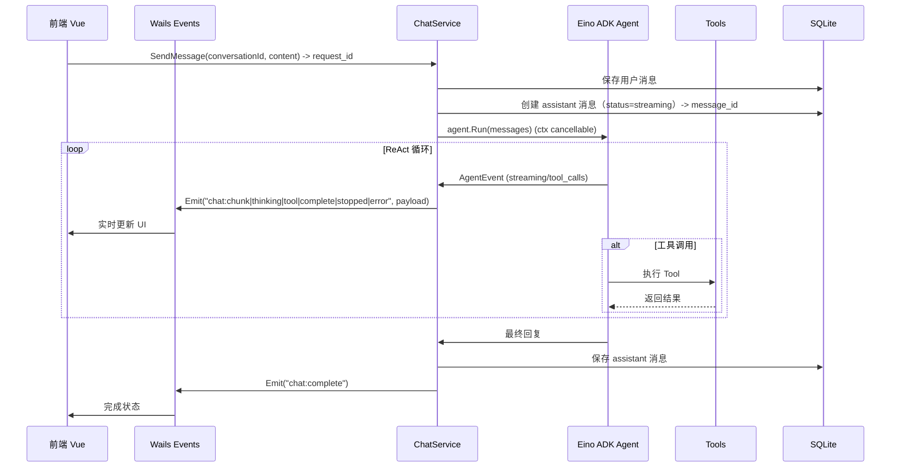

# ReAct 聊天系统实现计划（Eino ADK）

## 术语与命名约定（避免歧义）

- **ReAct**：指推理范式（Reason + Act），与前端框架 React 无关。
- **request_id**：一次“生成”的唯一 ID（一次 SendMessage 或一次 EditAndResend 都会生成新的 request_id），用于防止前端把旧流式事件串到新消息上。
- **seq**：同一 request_id 下的递增序号，用于前端按序拼接 chunk。

## 整体架构




## 事件协议（v1，建议先定型再写代码）

事件名保持简单稳定，payload 统一包含以下“头部字段”，避免串台/乱序：

- `conversation_id: number`
- `tab_id: string`（**视图实例 ID**：唯一标识“哪个标签/哪个窗口里的哪个标签”。用于后端判定“同会话多标签同时发送”。推荐格式：`<window_instance_id>:<tab_local_id>`，例如 `main-6f2c...:tab-3`、`chatwin-a19b...:default`）
- `request_id: string`
- `seq: number`（从 1 递增）
- `message_id?: number`（assistant 消息 id；`complete/stopped/error` 必带）
- `ts: number`（毫秒时间戳，便于调试）

事件列表与 payload（仅展示关键字段）：

- `chat:start`
  - `status: "streaming"`
  - `message_id: number`（本次 assistant 消息 id）
  - `request_id: string`（本次 generation id）
- `chat:chunk`
  - `delta: string`（assistant 最终内容的增量片段）
- `chat:thinking`
  - `delta: string`（thinking 内容增量片段）
- `chat:tool`
  - `type: "call" | "result"`
  - `tool_call_id: string`
  - `tool_name: string`
  - `args_json?: string`（call 时）
  - `result_json?: string`（result 时；建议为 JSON 字符串，便于后续兼容）
- `chat:complete`
  - `finish_reason: string`
  - `status: "success"`
- `chat:stopped`
  - `status: "cancelled"`
- `chat:error`
  - `status: "error"`
  - `error_key: string`（后端 i18n key）
  - `error_data?: any`（模板数据）

前端处理规则：

- **按 `conversation_id` 路由**到对应会话状态（多标签通常是多个 conversation 同时存在）。
- **同一 conversation 只接受当前活跃 `request_id**` 的事件；收到 `chat:start` 时更新活跃 `request_id`（防止旧流串台）。
- `seq` 非递增时丢弃或缓存重排（v1 可先丢弃并记录日志）。

## 多标签/多窗口支持（浏览器式多标签 + 子窗口）

现状能力（已具备）：

- 后端事件采用 `app.Event.Emit(...)`，**会广播到所有 Webview 窗口**；因此新增子窗口无需改后端事件机制。
- 前端已是多入口构建（`index.html`/`winsnap.html`/`selection.html`），每个窗口有独立的 JS 运行时与 Pinia store。

需要遵循的约束（确保不会串台/不会误取消）：

- 所有 chat 事件 payload 必须带 `conversation_id + request_id`；前端按 conversation 路由、按活跃 request 过滤（详见事件协议）。
- **切换标签不应影响流式**：标签只是视图，后台 generation 继续运行；标签重新激活时直接读取 store/DB 的最新内容。
- **多个标签同时打开同一 conversation**：它们应当看到同一份实时流式（共享同一 conversation 状态）；避免“每个标签一套独立请求”导致历史分叉。
- **同一 conversation 的并发发送（多标签同时发消息）**：不走队列，后端直接拒绝并返回可 toast 的业务错误（见并发策略）。

关闭标签（Tab Close）时的处理（必须定义清楚）：

- 前端：关闭标签前，调用后端释放“视图订阅”（建议 `ChatService.DetachView({ conversation_id, tab_id })`，best-effort），并卸载该标签的事件订阅/状态引用。
- 后端：维护 `conversation_id -> viewers(tab_id set)`：
  - `AttachView` 在打开标签/切换到会话时调用（或首次进入会话页时调用）。
  - `DetachView` 在关闭标签时调用。
  - 如果该 `conversation_id` 正在生成，且 `DetachView` 后 viewers 为空：**自动 StopGeneration**，并按 `cancelled` 落库（避免“无任何视图在看却继续烧 token”）。
  - 如果 viewers 不为空：generation 继续，其他视图照常收到广播事件并更新 UI。

实现子窗口的落点（推荐复用现有模式）：

- 后端：在 `internal/services/windows/definitions.go` 增加一个窗口定义（例如 `WindowChat`），URL 指向 `/chat.html`，通过 `WindowService.Show("chat")` 打开。
- 前端：新增 `chat.html` + `frontend/src/chat/main.ts`（结构参考 `winsnap.html` / `src/winsnap/main.ts`），并在 `frontend/vite.config.ts` 的 `rollupOptions.input` 增加 `chat: "chat.html"`。
- UI：子窗口可直接复用同一套 `chat` 组件与 `useChatStore/useChatEvents`，避免维护两套逻辑。

## 后端实现

### 1. 创建 Tools 模块（预留配置入口）

**文件**: `internal/services/tools/`

- `registry.go` - 工具注册表（预留配置入口）
  ```go
  // ToolRegistry 管理所有可用工具
  type ToolRegistry struct {
      tools map[string]ToolFactory
  }

  // GetAllTools 获取所有工具（当前默认全部启用）
  func (r *ToolRegistry) GetAllTools(ctx context.Context) ([]tool.BaseTool, error)

  // GetEnabledTools 根据配置返回启用的工具列表（预留入口，当前返回全部）
  func (r *ToolRegistry) GetEnabledTools(ctx context.Context, config *ToolsConfig) ([]tool.BaseTool, error)
  ```
- `calculator.go` - 计算器 Tool
  - 工具 ID: `calculator`
  - 使用 `github.com/cloudwego/eino/components/tool/utils.InferTool` 创建
  - 支持基本四则运算和数学函数
- `duckduckgo.go` - DuckDuckGo 搜索 Tool
  - 工具 ID: `duckduckgo_search`
  - 使用 `github.com/cloudwego/eino-ext/components/tool/duckduckgo/v2`
  - 配置 `MaxResults: 5`, `Region: RegionWT`
- `config.go` - 工具配置结构（预留）
  ```go
  // ToolsConfig 工具配置（预留，当前默认全部启用）
  type ToolsConfig struct {
      Calculator      bool `json:"calculator"`
      DuckDuckGoSearch bool `json:"duckduckgo_search"`
  }

  // DefaultToolsConfig 返回默认配置（全部启用）
  func DefaultToolsConfig() *ToolsConfig
  ```

### 2. 创建 Chat 服务

**文件**: `internal/services/chat/`

- `service.go` - 主服务
  ```go
  type ChatService struct {
      app               *application.App
      toolRegistry      *tools.ToolRegistry
      activeGenerations sync.Map // map[int64]context.CancelFunc - 每个 conversation 同时只允许一个 generation
  }

  // SendMessage 发送消息并启动 ReAct 循环
  func (s *ChatService) SendMessage(input SendMessageInput) error

  // EditAndResend 编辑消息并重新发送（丢弃后续消息）
  // archiveMessages 参数预留存档入口，当前默认 false 直接删除
  func (s *ChatService) EditAndResend(input EditAndResendInput) error

  // StopGeneration 停止当前生成（通过 context 取消）
  func (s *ChatService) StopGeneration(conversationId int64) error

  // GetMessages 获取对话消息列表
  func (s *ChatService) GetMessages(conversationId int64) ([]Message, error)

  // DeleteMessagesAfter 删除指定消息之后的所有消息（内部方法，预留存档入口）
  func (s *ChatService) deleteMessagesAfter(ctx context.Context, conversationId, messageId int64, archive bool) error
  ```
- `agent.go` - Agent 管理
  - 根据 Agent 配置创建 ChatModelAgent
  - 根据工具配置动态注册 Tools
  - 处理流式输出事件
- `model.go` - 数据模型
  - **以现有迁移 `internal/sqlite/migrations/202602051000_add_chat_messages.go` 的 messages 表为准**
  - 需要对齐的关键字段：
    - 基础：`id/created_at/updated_at/conversation_id/role/content`
    - 模型信息：`provider_id/model_id`
    - 状态：`status`（pending/streaming/success/error/cancelled）、`error`
    - 统计：`input_tokens/output_tokens`
    - 元信息：`finish_reason`
    - ReAct：`tool_calls`（assistant）、`tool_call_id/tool_call_name`（tool）
    - 扩展：`thinking_content`

### 3. 并发与取消策略（必须先明确）

- **跨会话可并行**：不同 `conversation_id` 允许同时生成（多标签最常见场景）。
- **同会话单生成**：同一 `conversation_id` 任何时刻最多允许一个 active generation。
- **同会话多标签同时发送**：不走队列。后端检测到“该会话已有 active generation 且 tab 不同”时，直接返回业务错误，前端用 toast 提示即可。
- **SendMessage 行为**：
  - 若该 conversation 未在生成：立即开始 generation（emit `chat:start`）。
  - 若该 conversation 正在生成：
    - 同一 tab：返回业务错误（提示“正在生成中，请先停止”）或由前端先调用 `StopGeneration` 再重试发送（推荐显式 stop）。
    - 不同 tab：返回业务错误（提示“该会话正在其他标签生成中”）。
- **EditAndResend 行为**：这是“重写历史”，必须是强一致操作：
  - 若在生成中：先 stop 当前 generation（避免对已被重写的上下文继续生成）。
  - 删除/存档后续消息，更新被编辑消息内容，再开始新的 generation。
- **StopGeneration 行为**：
  - 只 stop 当前 active generation。
  - 没有活跃生成时返回业务错误（i18n key 对齐 `error.*`）。

### 4. 停止生成逻辑

**实现机制**: 通过 `context.WithCancel()` 控制

```go
// SendMessage 中
func (s *ChatService) SendMessage(input SendMessageInput) error {
    ctx, cancel := context.WithCancel(context.Background())
    s.activeGenerations.Store(input.ConversationID, cancel)
    defer s.activeGenerations.Delete(input.ConversationID)
    
    // 调用 Agent...
    // 如果 ctx 被取消，agent.Run() 会返回 context.Canceled 错误
}

// StopGeneration 中
func (s *ChatService) StopGeneration(conversationId int64) error {
    if cancel, ok := s.activeGenerations.Load(conversationId); ok {
        cancel.(context.CancelFunc)()
        return nil
    }
    return errs.New("error.chat_no_active_generation")
}
```

**停止后内容处理**:

- 将已生成的部分内容保存到数据库
- 消息状态标记为 `cancelled`（messages.status）
- 前端显示已生成的内容 + "已停止"标记
- 用户可以基于已生成内容决定是否重新生成

### 5. 流式消息推送机制（建议与落库策略配套）

推荐落库策略（减少 DB 写入次数，同时保证可恢复）：

- 生成开始：
  - 插入 user 消息（role=user, status=success）
  - 插入 assistant 消息（role=assistant, status=streaming）并拿到 `message_id`
  - 生成 `request_id`，后续事件全部携带
- 生成中：
  - 对外 emit `delta`（chunk/thinking/tool）
  - 内存累积 `content/thinking/tool_calls`（可选：按 300~800ms 节流更新 DB，v1 也可只在结束时落库）
- 结束/停止/异常：
  - 一次性更新 assistant 消息：`content/thinking_content/tool_calls/status/error/finish_reason/tokens`
  - emit `complete/stopped/error`

```go
// 事件类型
"chat:chunk"    // 流式内容片段
"chat:thinking" // thinking 内容
"chat:tool"     // 工具调用/结果
"chat:complete" // 生成完成
"chat:stopped"  // 用户停止生成（携带已生成的部分内容和 message_id）
"chat:error"    // 错误（使用 i18n key + data）
```

### 6. tool 结果的持久化建议（更利于回放/展示）

- 对每一次 tool result，插入一条 `role=tool` 的消息：
  - `tool_call_id/tool_call_name` 填充
  - `content` 存 `result_json`
- assistant 的 `tool_calls` 字段存调用数组（与迁移注释一致），便于模型侧兼容与前端渲染“工具调用记录”。

### 7. i18n 支持（后端）

**后端错误消息**: `internal/services/i18n/locales/`

```json
// zh-CN.json 新增
{
  "error.chat_conversation_not_found": "会话不存在",
  "error.chat_message_not_found": "消息不存在",
  "error.chat_no_active_generation": "当前没有正在生成的内容",
  "error.chat_generation_in_progress": "该会话正在生成中，请先停止后再发送",
  "error.chat_generation_in_progress_other_tab": "该会话正在其他标签生成中，请切回对应标签操作",
  "error.chat_agent_not_found": "助手不存在",
  "error.chat_model_not_configured": "模型未配置",
  "error.chat_provider_not_enabled": "供应商未启用",
  "error.chat_generation_failed": "生成失败：{{.Error}}",
  "error.chat_tool_execution_failed": "工具执行失败：{{.Tool}} - {{.Error}}",
  "tools.calculator.name": "计算器",
  "tools.calculator.description": "执行数学计算",
  "tools.duckduckgo.name": "网络搜索",
  "tools.duckduckgo.description": "使用 DuckDuckGo 搜索网络信息"
}
```

## 前端实现

### 1. 消息服务集成

**文件**: 自动生成 `@bindings/willchat/internal/services/chat`

### 2. 聊天状态管理

**新增/修改**（更优雅且可复用）：

- `frontend/src/stores/useChatStore.ts`
  - 存储：messages、activeRequestId、streamingState、pendingEdits
  - actions：sendMessage / editAndResend / stopGeneration / loadMessages
- `frontend/src/composables/useChatEvents.ts`
  - 订阅/反订阅 Wails events
  - 只处理当前 `activeRequestId` + 按 `seq` 拼接 `delta`

页面职责保持轻薄：

- `frontend/src/pages/assistant/AssistantPage.vue`
  - 调用 store actions
  - 只做布局与组件拼装，不直接写复杂事件协议逻辑

### 3. 消息渲染组件

**新增**: `frontend/src/components/chat/`

- `ChatMessage.vue` - 消息容器
  - 支持编辑模式（用户消息可编辑）
  - 显示编辑按钮（hover 时显示）
- `MessageContent.vue` - 内容渲染（Markdown）
- `ThinkingBlock.vue` - thinking 内容展示（可折叠）
- `ToolCallBlock.vue` - 工具调用展示
- `MessageEditor.vue` - 消息编辑器（编辑重发）

### 4. UI 交互

- 发送消息时显示 loading 状态
- thinking 内容默认折叠，可展开
- 工具调用显示名称、参数、结果
- 支持停止生成按钮
- **新增**: 用户消息 hover 显示编辑按钮
- **新增**: 点击编辑进入编辑模式，显示确认/取消按钮
- **新增**: 确认编辑时提示"将删除此消息之后的所有消息"
- 图标 SVG 使用 `currentColor`；颜色用语义类（如 `text-muted-foreground`）
- toast 样式遵循项目黑白灰科技风规范（popover 基底、克制区分状态）

### 5. i18n 前端文本（对齐项目约束：TS 模块）

**文件**: `frontend/src/locales/`

在 `zh-CN.ts` / `en-US.ts` 中新增（示意 key）：

- `chat.thinking`
- `chat.thinkingCollapse` / `chat.thinkingExpand`
- `chat.toolCalling`（含 `{tool}` 占位符）
- `chat.toolResult`
- `chat.stopGeneration` / `chat.stopped` / `chat.stoppedTip`
- `chat.regenerate`
- `chat.editMessage` / `chat.editConfirm` / `chat.editCancel` / `chat.editWarning`
- `chat.generating`

## 关键代码路径


| 模块       | 文件路径                                                                                |
| -------- | ----------------------------------------------------------------------------------- |
| Tools 模块 | `internal/services/tools/*.go`                                                      |
| Chat 服务  | `internal/services/chat/*.go`                                                       |
| i18n 后端  | `internal/services/i18n/locales/*.json`                                             |
| 服务注册     | `internal/bootstrap/app.go`                                                         |
| 前端页面     | `frontend/src/pages/assistant/AssistantPage.vue`                                    |
| 前端状态     | `frontend/src/stores/useChatStore.ts` / `frontend/src/composables/useChatEvents.ts` |
| 聊天组件     | `frontend/src/components/chat/*.vue`                                                |
| i18n 前端  | `frontend/src/locales/zh-CN.ts` / `frontend/src/locales/en-US.ts`                   |


## 数据流示例

### 示例 1: 正常发送消息

用户发送 "1+2等于多少"：

1. **前端** → `ChatService.SendMessage({conversation_id: 1, content: "1+2等于多少"})`
2. **后端** → 保存 user 消息到 DB
3. **后端** → 创建 assistant 消息（status=streaming），生成 `request_id`
4. **后端** → 获取所有 Tools（当前默认全部启用，预留配置入口）
5. **后端** → 创建 ChatModelAgent（注入 Tools），调用 `agent.Run()`
6. **ADK** → 模型返回 tool_calls: `[{name: "calculator", args: {expression: "1+2"}}]`
7. **后端** → `Events.Emit("chat:tool", {type: "call", tool_name: "calculator", args_json: "...", request_id, seq})`
8. **后端** → 执行 calculator tool，得到结果 "3"
9. **后端** → 插入 tool 消息到 DB（role=tool, tool_call_id/name, content=result_json）
10. **后端** → `Events.Emit("chat:tool", {type: "result", result_json: "...", request_id, seq})`
11. **ADK** → 模型生成最终回复 "1+2等于3"
12. **后端** → 流式推送 `Events.Emit("chat:chunk", {delta: "...", request_id, seq})`
13. **后端** → 结束时一次性更新 assistant 消息（status=success, finish_reason, content/tool_calls/thinking/token）
14. **后端** → `Events.Emit("chat:complete", {message_id: 2, request_id, seq, finish_reason})`

### 示例 2: 编辑消息重发

用户编辑第 3 条消息（当前共 5 条消息）：

1. **前端** → 显示编辑确认对话框"将删除此消息之后的所有消息"
2. **前端** → `ChatService.EditAndResend({conversation_id: 1, message_id: 3, new_content: "新内容"})`
3. **后端** → 若正在生成，先 stop；然后删除消息 4、5（预留存档入口）
4. **后端** → 更新消息 3 的 content
5. **后端** → 重新执行 ReAct 循环（同示例 1 的步骤 3-14）

## 依赖更新

需要将 `duckduckgo/v2` 从间接依赖改为直接依赖：

```bash
go get github.com/cloudwego/eino-ext/components/tool/duckduckgo/v2
```

## 后续扩展点

1. **消息存档**: `deleteMessagesAfter` 方法的 `archive` 参数，可实现消息存档而非删除
2. **工具开关界面**: 前端设置页面添加工具开关配置（后端入口已预留）
3. **更多工具**: `ToolRegistry` 支持动态注册新工具
4. **工具权限**: 可扩展为按 Agent 配置工具权限
5. **工具市场**: 未来可支持用户自定义工具（MCP 协议等）

